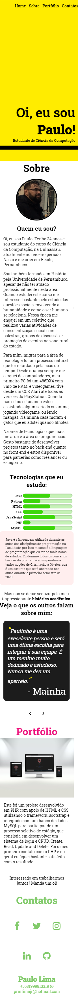

<h1>Site Pessoal e Portfólio</h1>

Este site foi desenvolvido em JavaScript puro, no final de 2019, quando eu estava iniciando meus estudos na linguagem. 

Foi desenvolvido com layout responsivo para ser acessado mobile first e depois estruturado para desktop. 

<h2>Versão Mobile</h2>

<h2>Versão Desktop</h2>

<h2>WIP</h2>
Este site tá sempre em atualização. Nos últimos meses eu deixei acumular algumas revisões e incorporações ao portfólio, mas em breve eu vou resolver essas pendências!
