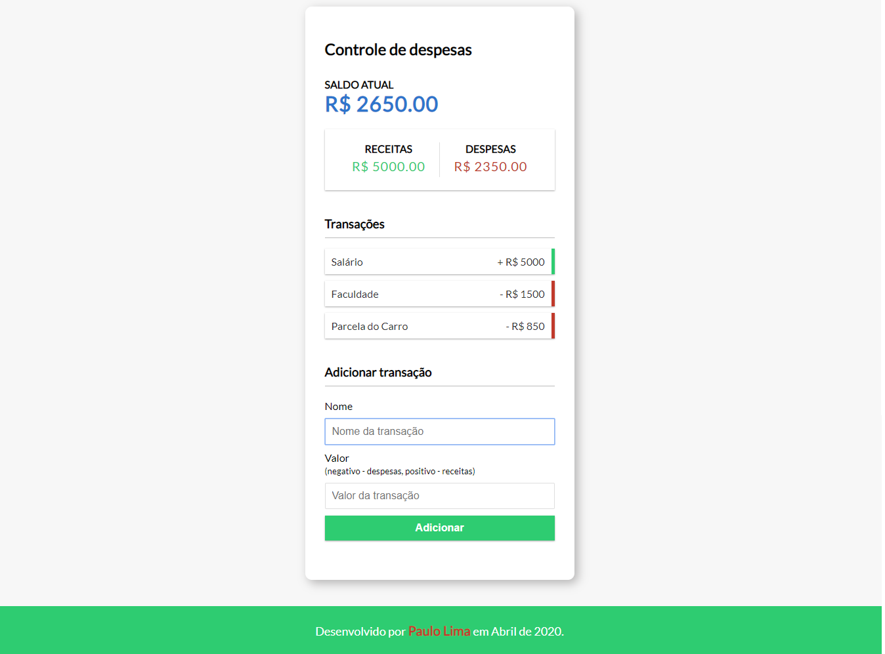

<h1>Controle de Despesas</h1>

Aplicação desenvolvida em JavaScript puro para controle financeiro. 

Não utiliza banco de dados integrado. A persistência dos dados se dá através do Local Storage do navegador.

Foi feito com a orientação do Roger Melo, através do https://www.youtube.com/watch?v=xarRciYWT5Q

<b>Há um bug que estou tentando corrigir no botão de excluir transações relacionado a um evento inline passado em um innerHTML.</b>

<h2>Próximos Features:</h2>
<ul>
  <li>Pretendo implementar integração com banco de dados para persistência e armazenamento das transações.</li>
  <li>Implantar sistema de login para verificação de usuário.</li>
  <li>Acrescentar armazenamento de datas das operações</li>
  <li>Acrescentar navegação por meses do ano.</li>
</ul>
