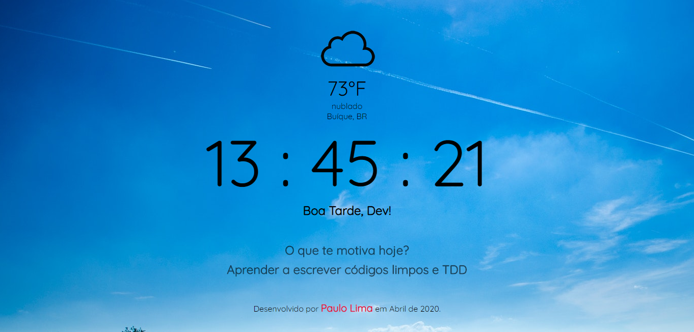
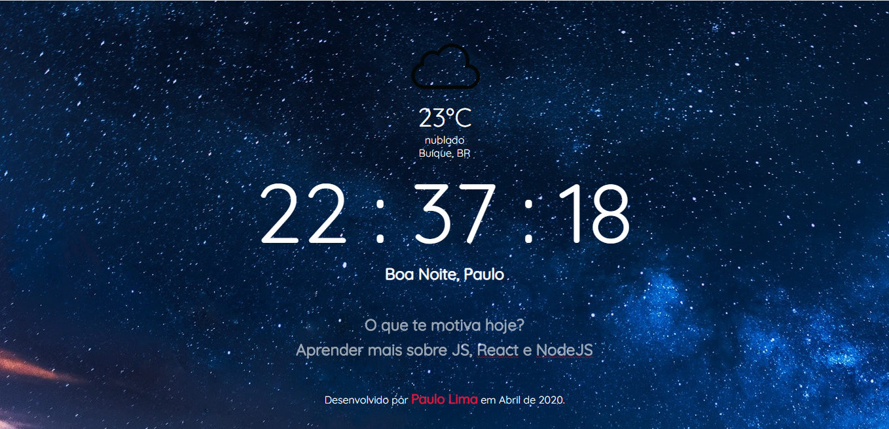

<h1>O que te motiva?</h1>
É uma aplicação em JavaScript que pode atuar como página inicial de navegação e servir para lembrar dos seus objetivos e dar aquele empurrãozinho.

A aplicação agrega um serviço de informação do tempo de acordo com a localização do usuário, usando a API do openweathermap. Ela verifica a localização e retorna a temperatura, em Celsius e Fahrenheit, o clima e a localidade. Tem também um relógio que controla a imagem de fundo da página. Uma saudação onde o usuário pode inserir seu nome e ele fica armazenado no local storage, e a pergunta "o que te motiva hoje?" em que o usuário também pode preencher e armazenar a informação no local storage.

